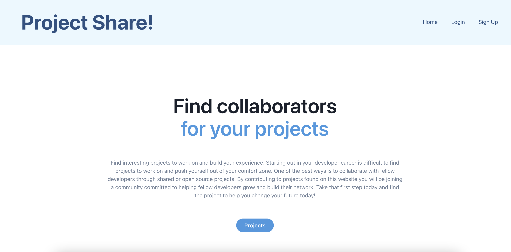
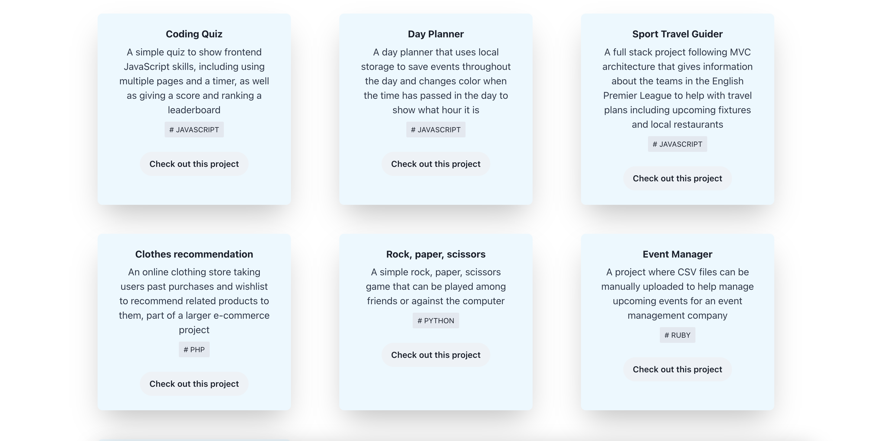
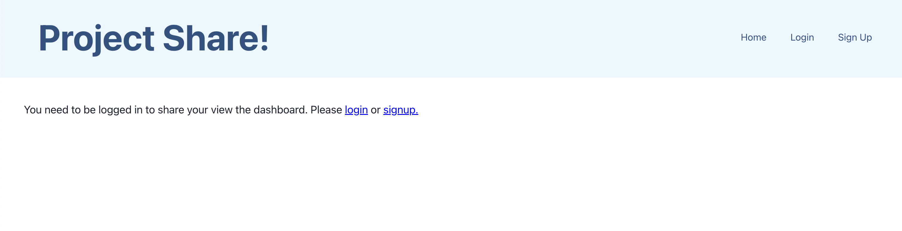
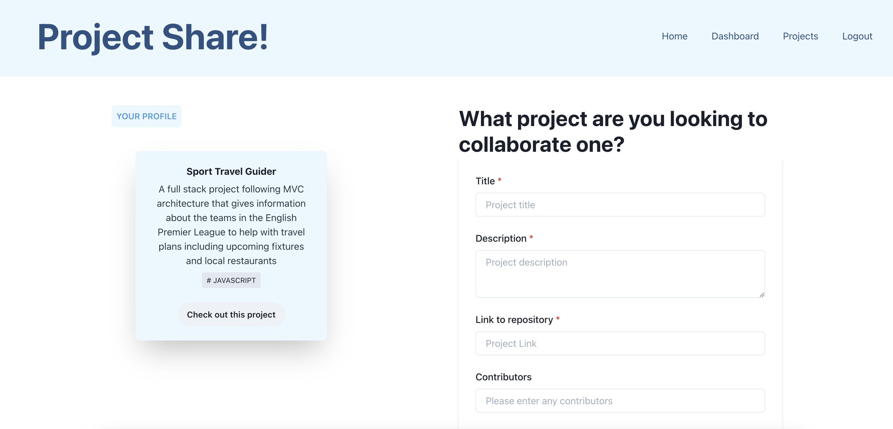
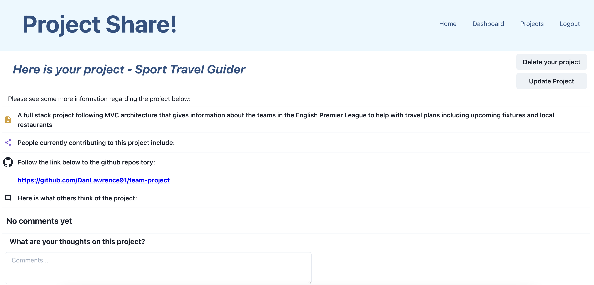
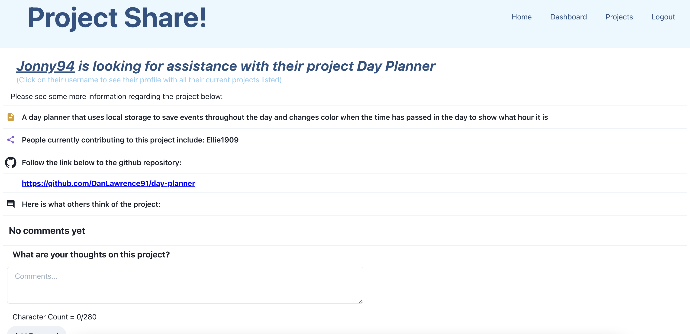

# Developer Collaboration Portal

## Description

The aim of this project is to create an environment where developers can log in and detail projects and websites they are building but may not have time to complete and learn necessary languages required for the project. By providing details of the project and what it entails, fellow developers can then either leave comments to assist, or they can get in touch with the developer to offer to collaborate on the project and offer to work with them on it.

## Technology used

- React
- Chakra UI
- Node.js
- Express
- GraphQL
- MongoDB
- Mongoose

## Installation

The project will need to be cloned from the repo and then run `npm install`. This will install all necessary packages required for the project. From there follow the different scripts in the package.json file, for example `npm run develop` will start both the server and the client side, to run the project how you wish.

## Usage

This project has been intended so that junior developers can use it to find new projects to work on and build up experience.

The home page explains the website and provides a dahsboard and button for navigation:

The user can then go to a page that lists the current projects on the website:

On this page there is a description of the website again, as well as the projects shown as cards on the page:

If a user is not logged in this is the only other page they can see as shown below - they cannot view single projects or the dashboard:

The dashboard allows you to add new projects and see your current projects:

If viewing one of your own projects on the single project page you have the option to update or delete the project:

If viewing someone else's project in more detail you can only add comments:

## License

This project is MIT licensed, please see the badge at the top of the page and associated file in repository

## Contributing

Contributions are welcome via pull requests. If anything major is to be proposed, please open an issue first to discuss what you would like to change.

## Deployed Site

This website is deployed on Heroku at the following [link](https://serene-spire-10596.herokuapp.com/).

## Questions

If there are any questions regarding this project please contact me through my email - dan.lawrence0810@gmail.com

Or please visit my GitHub profile which has further contact information - [DanLawrence91](https://github.com/DanLawrence91)
